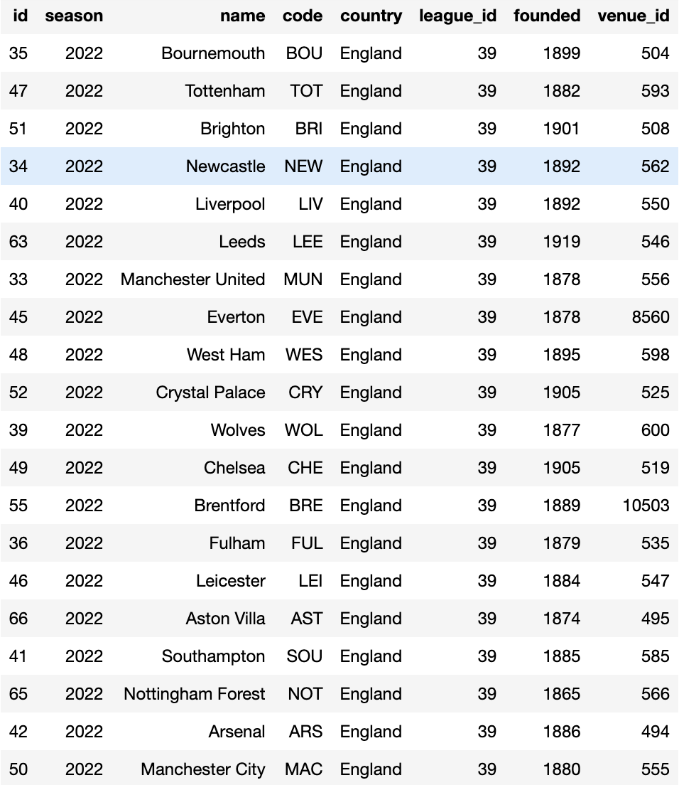

# Project Title
## Data Engineering Capstone Project

#### Project Summary
This project will show you how to build a cloud warehouse using Amazon AWS architecture solutions. I chose the data of football(soccer) matchs in the world to deploy the DW. Finally we will analyze this data to display all the information about the footabll game. 

The project follows the follow steps:
* Step 1: Scope the Project and Gather Data
* Step 2: Explore and Assess the Data
* Step 3: Define the Data Model
* Step 4: Run ETL to Model the Data
* Step 5: Complete Project Write Up

And the project package include 
* 1. CallAPI folder: these codes are used to call api and transform files format to put in S3.
* 2. airflow folder: the main project task source code, it will run in airflow system(I run these code in Data Pipelines project workspace)
* 3. QueryProjectDataResult.ipynb: the system data display and analysis results 
* 4. README.md: the project explanation

### Step 1: Scope the Project and Gather Data
#### Scope 
I am using API-Football's open data from the Rapid API as my source. It provides data about countries, leagues, teams in league, players information, matchs information(fixture)...etc. The api allow me to call them through different endpoints with the program, and put parameters to query them, and the data can saved in json file format, I can load them into S3. Then I will create ETLs and excetue them to load the data into data model I design in PostgreSQL DB. Finally I will query the data by different dimesons to analyze the football data.
I use the skills about python language and pandas package to help me process these JSON formatted files. The tools and platforms I use are Amazon AWS S3, redshift cluster and airflow, DB uses PostgreSQL, which is a cloud relational DB system. 

#### Describe and Gather Data 
I use the API is API-Football(https://rapidapi.com/api-sports/api/api-football), And it comes from Rapid API. It provides a lot of  endpoints to call. I will use 8 endpoints as my data source, and save one data as csv, and others are JSON format. As follows are my using list.
- Countries: provides the code and name of the countries, and I will save it as csv format.
- Leagues: provides information of the the leagues.
- Teams: provides the teams in every league. including the teams' id and their information, and the venue's information.
- Players: provides playrers' id and information and  their statistic data.
- Standings: Provides annual ranking data for multiple leagues.
- fixtures: Provides information about the matches for each year.
- fixture/linups: provides starters and substitutes information in the fixture.
- fixture/statistics: provides a lot of statistic data in the fixtures.

### Step 2: Fetch and Rearrange the Data
#### How to prepare the Data 
This step is spend me most time in my project development. I had to normalize and flatten JSON array and saved these JSON format data by multi lines before they imported to S3. Because I will use COPY from Amazon S3 command to fast load these files into the tables in Redshift DB. I had to follow the S3 JSON format rule. When I call the api's endpoint, I need to rearrange these data. As follows I will list the skills I used. More details please read my codes in CallAPI folder.
- json.dumps(): serialize the python object to be a json format string.
- json.loads(): Deserialize the JSON string to be a python object.
- Pandas json_normalize(): flatten the nest JSON object to be a two-dimensional data frame, but if the source include sub array key value JSON format, it will remain the format. we have to use another way to process it.
- Pandas DataFrame assign(): add new column and value into data frame. sometimes we need to add or drop columns in the json files. I choice to process them before these files into S3.
- Pandas concat(): Concatenate two pandas objects along a particular axis. sometimes I will extract the array key data of JSON format and flatten it. Then I will join them return be a one data frame.
- Pandas DataFrame to_json(): change the result data frame to become a json document format.
You can find FlattenJSONFile() function in many jupyter note files(like playersUpload.ipynb, LineUpUpload.ipynb...etc) in CallAPI folder to read more details. And All the call API programs are independence to process different situation.

#### Access data Steps
Access the data follows the follow steps:
* Step 1: Importing the configure file that include S3 AWS_ACCESS_KEY_ID and AWS_SECRET_ACCESS_KEY, and API X_RapidAPI_Key and X_RapidAPI_Host I owned.
* Step 2: Requesting the API and get the response JSON array format string. sometimes before call the api, I will use some ways to check the result file if it exists. If it exists, I will skip over the procedure to reduce the request. Rapid API will charge more if the request exceeded the limit.
* Step 3: Flattening and rearranging JSON format string if needed.
* Step 4: Putting object to S3
* Step 5: Deleting the serch used files if needed in S3 folders. sometimes I will used the file's name or values in the file content be a search parameter in query API. so I will killed them when I finished the process. and next time I can continue the query procedure by loading these files.

### Step 3: Define the Data Model
#### 3.1 Conceptual Data Model
- 1. Identify the Dimensions:
    - Dimension tables provide content of definition at different dimension, like countries, leagues, teams, players and so on.
    - The dimensions identified in this project are:
        - countries
        - leagues
        - teams
        - venues
        - players
        - fixtures
        - lineups
        
- 2. Identify the Facts:
    - Fact tables focus on the statistics of players and match(fixtures), and Standings by every league data, these fact tables and dimension tables relationship become a star schema diagram. 
    - The fact table identified in this project is:
        - player_statistics
        - match_statistics
        - league_standings

We can see the below picture to check these relationship of the tables.        

#### 3.2 Mapping Out Data Pipelines
List the steps necessary to pipeline the data into the chosen data model
* Step1: Create All tables if needed
* Step2: Load the data from S3 into stage tables
* Step3: Extract data from stage tables into dimension tables
* Step4: Extract data from stage tables into fact tables
* Step5: Perform data quality checks

### Step 4: Run Pipelines to Model the Data 
#### 4.1 Create the data model
Build the data pipelines to create the data model.
We can see the below picture to show the ETL task dependency.

#### 4.2 Data Quality Checks
I had check the Dimension table and Fact table in airflow class DataQualityOperator(). It's file name is data_quality.py.As follows:
* def checkCount(self, redshift): check the all dimension tables and fact tables if has records. if these tables are no record in that. The function will raise ValueError() and return error message.
* def checkUniqueKey(self, redshift): I find the redshift doesn't check the primary key constraint, so I had to do this in data quality check, if the tables had the duplication rows in the same PK, the function will raise ValueError() and return error message.
 
#### 4.3 Data dictionary 
I use online free tool dbdiagram.io to create a data dictionary for my data model. It can use script to define table schema and  their relationship. I had add all table note and necessary columns description in that.but it doesn't provide download file, so please link to see the data dictionary.
https://dbdocs.io/michaeltainan/Capstone-Project

### Step 5: Complete Project Write Up
#### 5.1 Data analysis results
We can find the QueryProjectDataResult.ipynb file I run the query sql in root to analyze the football game information to check result. First I check the every tables row count if all of them have more than 1 million lines of data, then I query my favorite league to show all the teams in Premier League in 2022-2023.

2022-2023 Premier League Teams

 I query some fixture of Manchester City Club, then use one fixture id to find the match game infomation, and see the two teams start lineup players.

ManCity 5 Fixtures List

One Fixture Infomation

ManUnited Starter in the Fixture

ManCity Starter in the Fixture

Then I query the match_statistics and join some dimension table to analyze the match games statistic data, and check my favorite player's statistics.

Fixture Match Statistics

Player Infomation and Statistics

 Finally, I query the league_standings table to show this year's standing, rank, and display their results.

2022-2023 Premier League Standing
#### 5.2 The rationale for the choice of tools and technologies
* Use the Python language in jupyter notebook to call api to load into S3, because jupyter notebook can run the code step by step and print the result. It is very important for me to understand the data content and allow me to adjust how to fit the S3 json format. I choice to use the football data I am interested, and I think that if I need to build projects at work in the future, I have face every situation, so I tend to call APIs provided by 3 parties, but I really spend most of the time in this phase.
* Select S3 to store dataset, because I need to use it's copy technologies to load data into table fastlly. Then the choice to use Redshift, not Spark is just the cost consideration, I think I have to rebulid the system with limited time, I have to choose the cheaper cost to build. I hope that I can select Spark to build the sysem in the future .
* Airflow to manage the ETL, because I will use it in my future work. I need to learn to use it to automate tasks.
#### 5.3 Propose how often the data should be updated and why
Because I am only building a project this time, using old data, my schedule is updated once a month. The work has at least been updated by date when my profile time catches up with the real world game data.
#### 5.4 The project includes:
* At least 2 data sources: I use 8 endpoint sources to be a data sources.
* More than 1 million lines of data: fixtures and lineups data over 1.9 million lines.
* At least two data sources/formats (csv, api, json): use csv format in countries data, others use json format.
#### 5.5 The write up describes a logical approach to this project under the following scenarios:
 * The data was increased by 100x:
   If the data was increased by 100X, I would use Spark or Cassandra DB to build the system. Because Spark architecture is more quickly to process the data. Cassandra db can save these data by JSON format. And it can reduce the amount of data.
 * The data populates a dashboard that must be updated on a daily basis by 7am every day.
   Because I had use airflow to maintain the project task, it can satisfy the requirement.
 * The database needed to be accessed by 100+ people.
   Because I had use redshift to build the project, I think if I add amount of notes or choose diffent clusters that amazon AWS provided in the future, it can fit the requirement, but need to more budget.